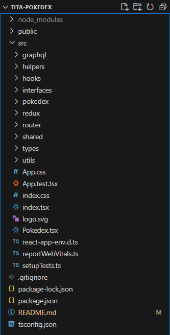
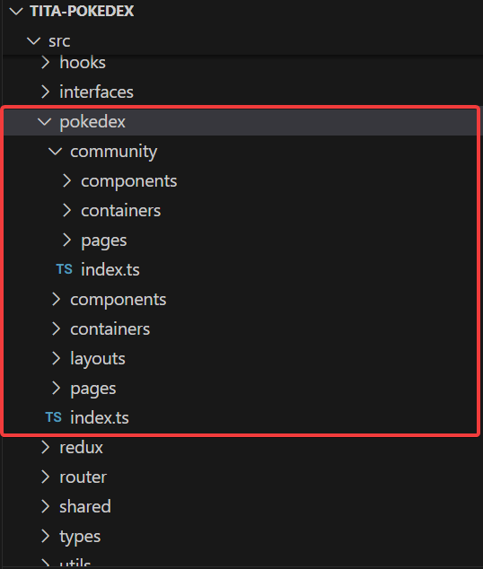
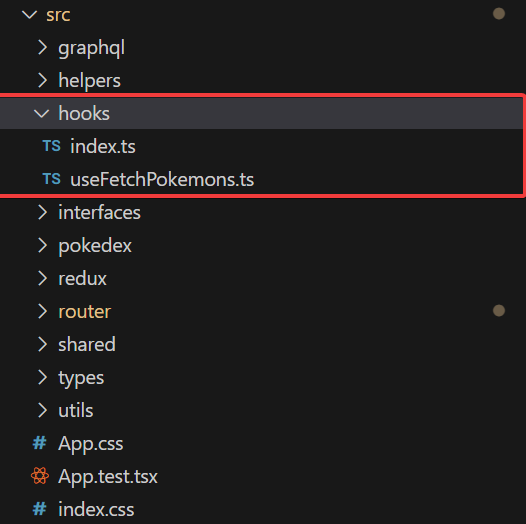
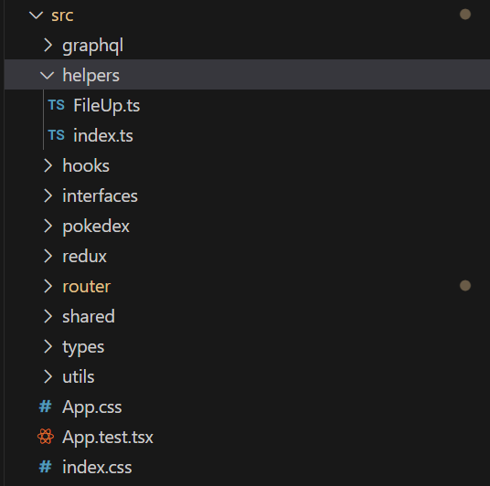
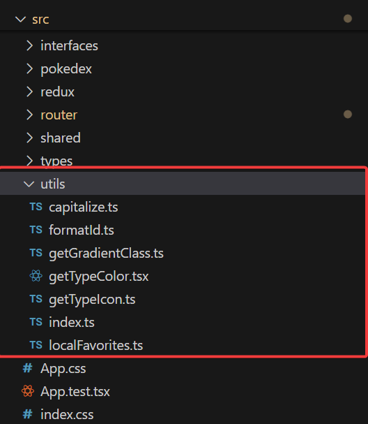
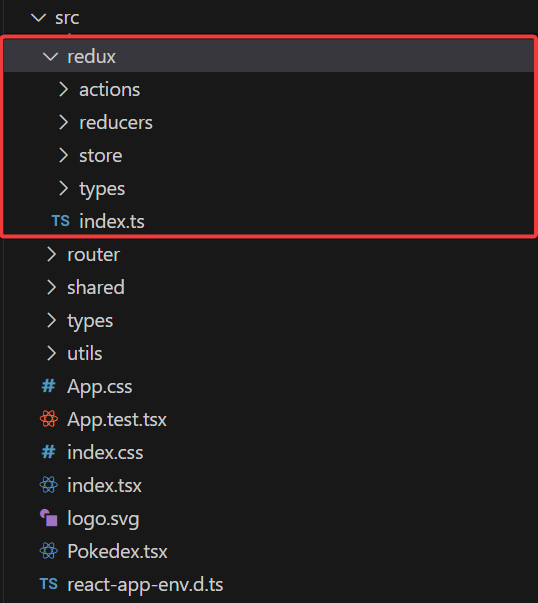
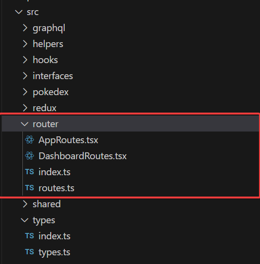
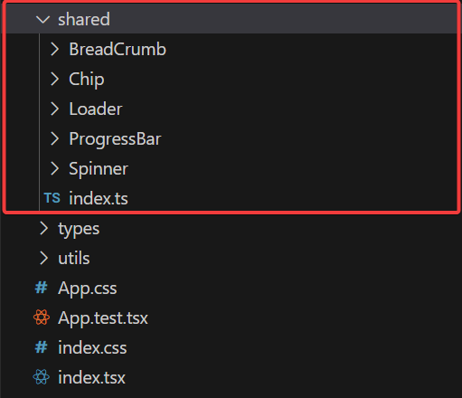
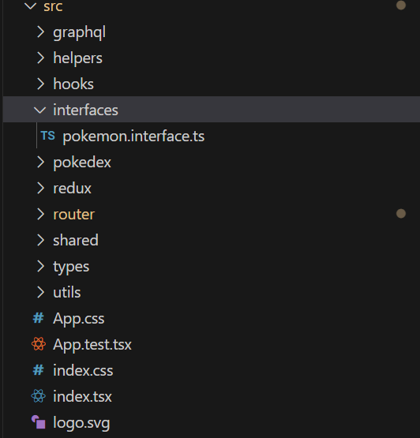
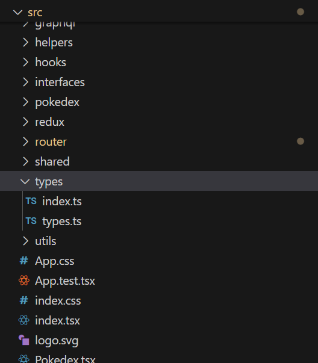

# 👋🏼 Hola! Bienvenido a Tita Pokedex.

<h3 align="center"><strong>Pokedex - Tita Media 💗</strong></h3>

El objetivo principal del aplicativo es que el usuario pueda obtener una lista de pokemones, ir al detalle de cada uno de ellos, búscar pokemones, agregar a favoritos, crear y editar sus propios pokemones, asi cómo ver las creaciones de otros usuarios dentro de la comunidad.

# Estado del Proyecto:

Este proyecto se encuentra terminado ✅, al día 25 de septiembre del 2024. Este proyecto fue construido mediante el comando npx create-react-app y está en su versión 18.3.8.

# Este Repositorio en tu entorno

### Requisitos previos recomendados:

-  Versión más reciente de Windows 10 (versión posterior a la 1903 y compilación posterior a la 18362) o Windows 11.
-  Subsistema de Windows para Linux (WSL), incluida una distribución de Linux (como Ubuntu), y asegúrese de que se ejecuta en modo WSL 2. Para comprobarlo, abre PowerShell y escribe: wsl -l -v.
-   Node.js en WSL 2.

### Cómo clonar el Repositorio en Windows:

- Copia la url del repositorio.
- Abre cmd (ventana de comandos), y navega con cd a la carpeta en la que quieras clonar.
- Utiliza el comando git clone y pega la url, presiona Enter.
- También puedes usar git bash directamente.

### Cómo clonar usando la terminal de Ubuntu:

- Abre Git Bash.
- Vaya al directorio actual donde desea que se agregue el directorio clonado.
- utiliza la url de este repo ya copiada.
- Haga clic en “Clonar o descargar” y copie la URL.

# Url para Clone

### https://github.com/josedbolivarma/tita-pokedex-front.git

Esta es una aplicación React, puedes clonar el repositorio y utilizar el comando:

```
npm i
```

Para probar el proyecto de forma local, puedes correr:

```
npm start
```
Para correr las pruebas:

```
npm test
```
Inicia el corredor de prueba en el modo de reloj interactivo.\
Consulte la sección sobre [ejecutar pruebas] (https://facebook.github.io/create-react-app/docs/running-tests) para obtener más información.
Puedes correr la aplicación en modo desarrollo.\

Abre [http://localhost:3000](http://localhost:3000) para ver en tu navegador.


La página se recargará cuando realices cambios. Puedes ver errores en la consola.

### `npm run build`

Construye la aplicación para producción en la carpeta `build`.\
Empaqueta correctamente React en modo de producción y optimiza la compilación para obtener el mejor rendimiento.

La compilación se minimiza y los nombres de archivo incluyen los hashes.\
¡Tu aplicación está lista para ser implementada!

Consulte la sección sobre [implementación](https://facebook.github.io/create-react-app/docs/deployment) para obtener más información.

# Desarrollo:

## Estructura del Proyecto

- **/src**: Código fuente principal.



- **/src**: Código fuente principal.
  - **/pokedex**: Vistas.

Se creó un módulo principal correspondiente al archivo raiz encargado de la página de lista de pokemones, página de detalle de cada pokemon, y la página de favoritos, y el módulo "community" que corresponde a la lista, el detalle y la creación de los pokemones personalizados por nuestros usuarios.



- **/src**: Código fuente principal.
  - **/hooks**: Custom Hooks.

  * useFetchPokemons.ts
    Este custom hook se aplica sobre el módulo "community" y se encarga de las operaciones de listar, ver detalle y agregar los pokemones sobre nuestra [API REST](https://tita-pokedex-back-production.up.railway.app/).



- **/src**: Código fuente principal.
  - **/helpers**: Funciones auxiliares medianamente complejas.

  * FileUp.ts
    Maneja las funcionalidades relacionadas con la carga de archivos en [Cloudinary](https://cloudinary.com/)



- **/src**: Código fuente principal.
  - **/utils**: Funciones auxiliares y de transformación.

* localFavorites.ts
  Maneja las funcionalidades relacionadas con el local storage para agregar y cargar pokemones en la lista de favoritos.



- **/src**: Código fuente principal.
  - **/redux**: Estado Global Con Redux.

Se configuró redux para manejar el estado global del módulo principal de pokemones, a través de graphql se implementaron las acciones de listar y buscar pokemones tanto por nombre cómo por id.




- **/src**: Código fuente principal.
  - **/router**: Rutas modulares e implementación de Lazy Load.

 * AppRoutes.tsx 
     Entry point de las rutas que posteriormente puede será implementado para gestionar el manejo de rutas públicas y privadas dentro del flujo de la aplicación.

 * DashboardRoutes.tsx 
     Componente que gestiona y renderiza las rutas dinámicas de la aplicación, mapeando cada ruta definida en un array y redirigiendo a la ruta principal en caso de que no coincida ninguna.

 * routes.ts 
     Presenta el conjunto de rutas y componentes configurados con carga diferida (lazy load) para mejorar el rendimiento, cargando el componente solo cuando se navega a la ruta correspondiente.




- **/src**: Código fuente principal.
  - **/shared**: Componentes globales reutilizables



- **/src**: Código fuente principal.
  - **/interfaces**: Interfaces y tipados de la aplicación



- **/src**: Código fuente principal.
  - **/types**: Contiene datos reutilizados a lo largo de la aplicación, cómo los elementos de cada pokemon.



# Despliegue:

- [Tita Pokedex Front](https://tita-pokedex-front.vercel.app/)
- [Tita Pokedex Back](https://tita-pokedex-back-production.up.railway.app/)

## Este proyecto ha sido construido con:

* [React](https://es.reactjs.org/) : ^18.3.8

### Algunos usos importantes del proyecto:

* [Cloudinary](https://cloudinary.com/) : Carga y subida de imágenes
* [Apollo Client](https://www.apollographql.com/docs/react/) : ^16.9.0
* [GraphQL](https://graphql.org/) : ^3.11.8
* [React-redux](https://react-redux.js.org/) : ^7.2.9 
* [Redux](https://es.redux.js.org/) : ^4.2.1 
* [TypeScript](https://www.typescriptlang.org/) : ^4.9.5
* [react-router-dom](https://v5.reactrouter.com/web/guides/quick-start) : ^6.26.2


# 📚 Autores (se ordenan Alfabéticamente):

- [Jose David Bolivar Mayora](https://github.com/josedbolivarma) Desarrollador Frontend / FullStack. 


